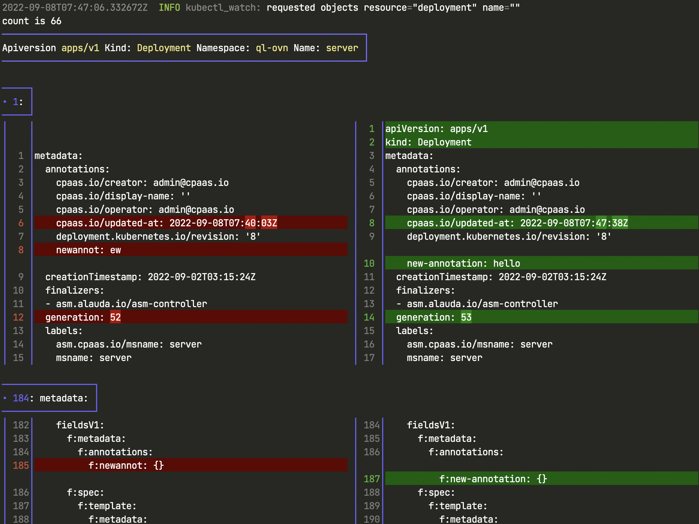

# kubectl-watch
another watch tool with visualization view of delta change for kubectl



## Installation

### cargo install

```bash
cargo install kubectl-watch --locked
```

### docker image

1. Docker should be preinstalled, more installation details please visit [official website](https://docs.docker.com/engine/install/).

2. copy the kubectl-watch script into your $PATH folder
```bash
cp script/kubectl-watch /usr/local/bin/
chmod +x /usr/local/bin/kubectl-watch
```

## Usage

watch deploy in all namespace
```bash
kubectl-watch deployment -A
```

watch deploy on some namespace
```bash
kubectl-watch deployment -n {your-namespace}
```

watch with delta view, just add `--delta` arg.
```bash
kubectl-watch deployment -n {your-namespace} --delta
```

run `kubectl-watch -h` to get help msg.
```bash
kubectl-watch

USAGE:
    kubectl-watch [OPTIONS] [ARGS]

ARGS:
    <RESOURCE>
    <NAME>

OPTIONS:
    -A, --all                      If present, list the requested object(s) across all namespaces
    -d, --delta                    Show delta changes view
    -h, --help                     Print help information
    -l, --selector <SELECTOR>      Selector (label query) to filter on, supports '=', '==', and
                                   '!='.(e.g. -l key1=value1,key2=value2)
    -n, --namespace <NAMESPACE>    If present, the namespace scope for this CLI request
```


## Develop

clone the project
```
git clone --recurse-submodules -j8 git@github.com:imuxin/kubectl-diff.git
git submodule update --init --recursive
```

## Thanks

- [delta](https://github.com/dandavison/delta)
- [kube-rs](https://github.com/kube-rs/kube-rs)
- [rust](https://github.com/rust-lang/rust)
