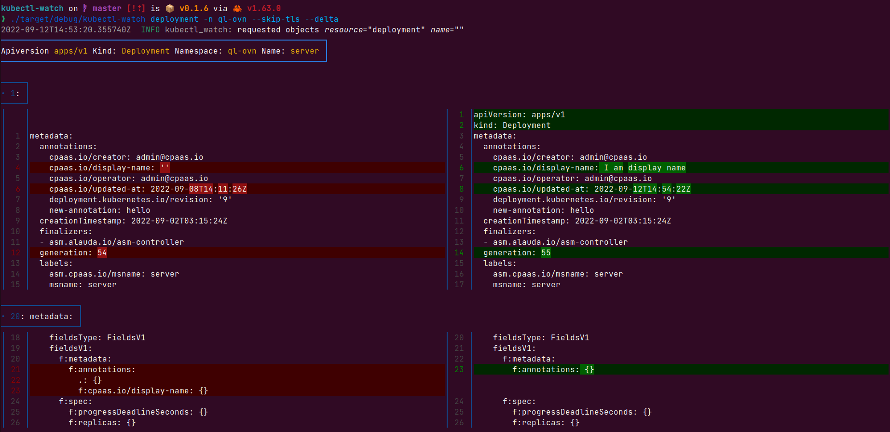
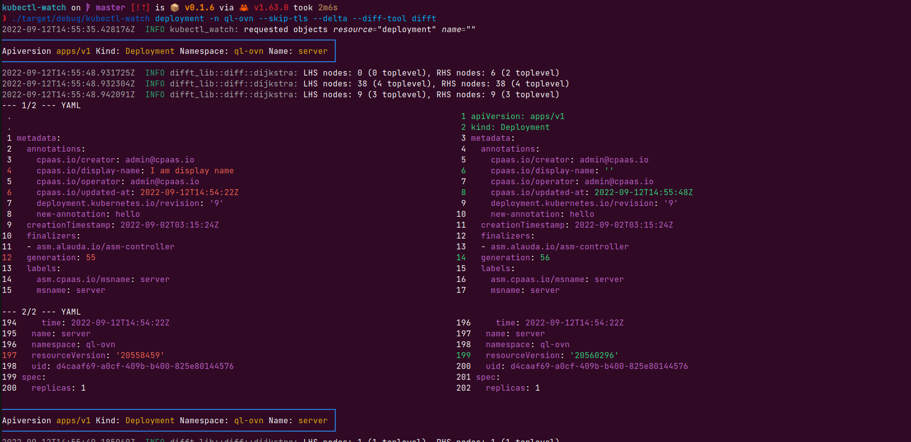

# kubectl-watch

[中文](./README-zh.md)

Another watch tool with visualization view of delta change for kubernetes resources.

|         overview of using delta diff tool          |       overview of using difftastic diff tool       |
| :------------------------------------------------: | :------------------------------------------------: |
|  |  |


## Installation

### Use docker image [recommend]

1. Docker should be preinstalled, more installation details please visit [official website](https://docs.docker.com/engine/install/).

2. copy the kubectl-watch script into your $PATH folder
```bash
cp script/kubectl-watch /usr/local/bin/
chmod +x /usr/local/bin/kubectl-watch
```

### Download kubectl-watch from [release assets](https://github.com/imuxin/kubectl-watch/releases).

### Build and install from source using [Cargo](https://crates.io/crates/kubectl-watch):

```bash
cargo install kubectl-watch --locked
```

## Cmd Help

```bash
USAGE:
    kubectl-watch [OPTIONS] [ARGS]

ARGS:
    <RESOURCE>    Support resource 'plural', 'kind' and 'shortname'
    <NAME>        Resource name, optional

OPTIONS:
    -A, --all                       If present, list the requested object(s) across all namespaces
        --diff-tool <DIFF_TOOL>     Diff tool to analyze delta changes [default: delta] [possible values: delta, difft]
        --export <EXPORT>           A path, where all watched resources will be strored
    -h, --help                      Print help information
        --include-managed-fields    Set ture to show managed fields delta changes
    -l, --selector <SELECTOR>       Selector (label query) to filter on, supports '=', '==', and '!='.(e.g. -l key1=value1,key2=value2)
    -n, --namespace <NAMESPACE>     If present, the namespace scope for this CLI request
    -s, --skip-delta                Skip show delta changes view
        --use-tls                   Use tls to request api-server
    -V, --version                   Print version information
```

## Examples

watch deploy in all namespace
```bash
kubectl-watch deployment -A
```

watch deploy on some namespace
```bash
kubectl-watch deployment -n {namespace}
```

watch without delta view, just add `--skip-delta` flag.
```bash
kubectl-watch {resource} --delta
```

watch with delta view by using `difftastic` tool, just add `--diff-tool difft`
```bash
kubectl-watch {resource} --diff-tool difft
```

export watched resources into local storage, just add `--export "/to/your/path"`
```bash
kubectl-watch {resource} --export "/to/your/path"
```

`managed-fields` will be default excluded, add `--include-managed-fields` can show the managed fields changes.
```bash
kubectl-watch {resource} -include-managed-fields
```

## Acknowledgment

- [tui-rs](https://github.com/fdehau/tui-rs)
- [difftastic](https://github.com/Wilfred/difftastic)
- [kube-rs](https://github.com/kube-rs/kube-rs)
- [rust](https://github.com/rust-lang/rust)
